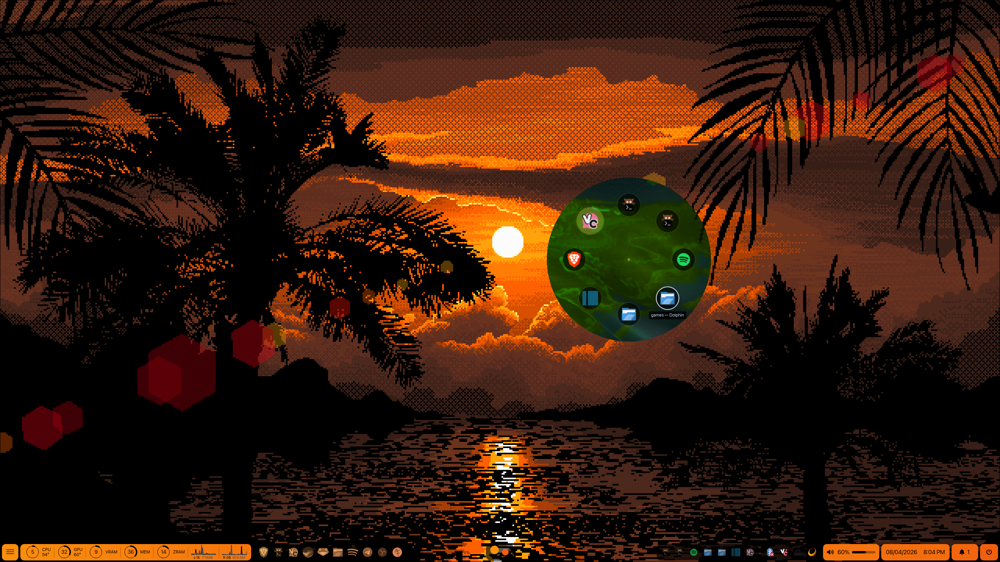

# Technicolor

🚨 This is basically entirely vibe coded (including most of the below lol)
   But 100% designed by me aside from the bugs :) 🚨

Uses [Hyprland](https://hyprland.org/), [Quickshell](https://quickshell.org/), and [mako](https://github.com/emersion/mako).

The bar is custom Quickshell, and its colors are pulled live from the current wallpaper. Workspaces are one long carousel that slides across every monitor together. It has an app launcher, live system monitors, a notification tray, per-monitor brightness, and an alt-tab pie menu.


## Demo

<!--[](https://youtu.be/VIDEO_ID)-->



## Install

Follow these top to bottom and you'll have a working setup.

### 1. Dependencies

Everything needed: `hyprland`, `quickshell`, `mako`, `xdg-desktop-portal-hyprland`, `pipewire` + `wireplumber`, `ddcutil`, `nethogs`, `jq`, `gawk`, `kitty`, `wofi`, `swww`, `imagemagick`, `python-pillow`, `grim`, `slurp`, `satty`, `wl-clipboard`, `playerctl`, `brightnessctl`, plus a Nerd Font (JetBrainsMono Nerd Font). Optional: `nwg-look`, `nwg-displays`, `dex`, `wlogout`, `gnome-keyring`.

Most share the same package name across distros. The newer ones to watch are `quickshell`, `swww`, and `satty`, plus Hyprland itself on older distros. Quickshell's per-distro install page: <https://quickshell.org/docs/master/guide/install-setup/>


  What each piece is for:

  - `hyprland` — the Wayland compositor everything runs on
  - `quickshell` — the framework the bar is built in
  - `mako` — notification daemon; the bar's tray is a frontend for it
  - `xdg-desktop-portal-hyprland` — screen-share and file-picker support for apps
  - `pipewire` + `wireplumber` — audio, and the volume controls
  - `ddcutil` — external-monitor brightness over the cable (the brightness sliders)
  - `nethogs` — per-app network usage (the network widget)
  - `jq` — JSON parsing in the scripts
  - `gawk` — number crunching in the system-monitor script
  - `kitty` — terminal
  - `wofi` — app launcher / run menu
  - `swww` — animated wallpaper daemon
  - `imagemagick` + `python-pillow` — pull the color palette out of the wallpaper
  - `grim` + `slurp` + `satty` + `wl-clipboard` — screenshots: capture, region-select, annotate, copy
  - `playerctl` — media keys (play/pause/next)
  - `brightnessctl` — laptop backlight keys
  - a Nerd Font (I use JetBrainsMono Nerd Font) — every icon and glyph in the UI
  - optional: `nwg-look` (GTK theme GUI), `nwg-displays` (monitor-layout GUI that writes
  monitors.conf), `dex` (runs XDG autostart entries), `wlogout` (power menu), `gnome-keyring`
  (secrets)

**Arch** (my distro; a few are AUR, so use `paru`/`yay`):
```
paru -S hyprland quickshell mako xdg-desktop-portal-hyprland pipewire wireplumber \
  ddcutil nethogs jq gawk kitty wofi swww imagemagick python-pillow \
  grim slurp satty wl-clipboard playerctl brightnessctl ttf-jetbrains-mono-nerd
```

**Fedora:** most via `dnf` under the same names (Hyprland is packaged on F39+). quickshell is a COPR:
```
sudo dnf copr enable errornointernet/quickshell && sudo dnf install quickshell
```
`swww` and `satty` may need a COPR or building from source.

**Debian / Ubuntu:** `apt` has most of these, but Hyprland and quickshell are usually too old or missing, so build those two from source.

**NixOS:** add the packages to `environment.systemPackages` (or home-manager). Hyprland and quickshell both ship flakes; see the Hyprland wiki's Nix page and quickshell's install docs.

### 2. Copy the configs
```
cp -r hypr quickshell mako ~/.config/
```

### 3. Set up the two per-machine files
`hyprland.conf` sources these, so they need to exist:
```
cp ~/.config/hypr/monitors.conf.example ~/.config/hypr/monitors.conf
cp ~/.config/hypr/local.conf.example    ~/.config/hypr/local.conf
```
- Edit `monitors.conf` for your displays. Run `hyprctl monitors` for names and modes, or use `nwg-displays`. The `preferred, auto` fallback works for a single screen as-is.
- `local.conf` is for machine-specific Hyprland bits (GPU driver, input quirks). It can stay empty.

### 4. Add wallpapers
Put animated wallpapers in `~/Wallpapers/animated/` (see the Wallpapers section). The bar regenerates its color palette from the current wallpaper automatically.

### 5. Enable monitor brightness
`ddcutil` needs you in the `i2c` group:
```
sudo usermod -aG i2c $USER
```
Log out and back in for it to take effect.

### 6. Log into Hyprland
Select Hyprland at your display manager (or start it from a TTY).

## Wallpapers

The animated wallpapers I use are pixel-art scenes by **Anas Abdin**: <https://www.tumblr.com/anasabdin>. The color extraction, nearest-neighbor upscaling, and wallpaper transition are tuned for that pixel-art style, so photos and other kinds of images may not look as good.

## Fonts

A Nerd Font is required or the icons render as boxes; I use JetBrainsMono Nerd Font (installed in step 1). The UI text is SF Pro, which is Apple's font, so I can't include it. Without it, set `QS_FONT` to a font you have (before Hyprland starts, e.g. in your shell profile):
```
export QS_FONT="Inter"
```

## What's where

- `hypr/` — Hyprland config and its scripts: the workspace carousel, wallpaper cycling and theming, taskbar, minimize, alt-tab.
- `quickshell/` — the bar (`Bar.qml`), the alt-tab pie, notification scripts, system-monitor helpers, shaders.
- `mako/` — notification styling. The bar's tray reads from mako.

## Swapping mako

mako is fairly baked in, so this isn't a one-liner. The tray shells out to `makoctl` and reads mako's JSON, and the theming and silencing rewrite mako's config file. To use something else (dunst, swaync, etc.), port these:

- `quickshell/notif-bump.sh` — `makoctl list -j` and the on-notify hook
- `quickshell/notif-clear.sh` — `makoctl dismiss`
- `quickshell/notif-activate.sh` — `makoctl invoke`
- `quickshell/notif-silence.sh` — rewrites mako's per-app silence rules
- `quickshell/notif-theme-mako.sh` — regenerates mako's colors from the wallpaper
- `mako/config` — the config format
- `quickshell/Bar.qml` — assumes mako's record fields (`app_icon`, `desktop_entry`, …)

## Notes

- mako is required for the notification tray; it's the actual daemon and the bar is the frontend.
- `nethogs` runs under sudo for the network widget; without a sudoers rule it stays blank.
- GPU, temperature sensors, and monitor brightness all auto-detect, so there's nothing to hardcode.
